# 🧠 AI-Assisted Software Engineering Research

This repository explores how **AI** and **automation** can improve the **developer experience**, software quality, and delivery efficiency — with a focus on **secure, human-in-the-loop workflows**.

I am developing **reusable processes**, **prompt frameworks**, and **automation pipelines** that integrate AI into everyday engineering tasks such as testing, dependency management, documentation, and workflow automation.

> _“Exploring how AI can enhance developer experience — from intelligent automation and testing to human-in-the-loop and agentic engineering systems.”_

---

## 🧩 AI Landscape Overview

A simplified view of how key AI areas fit together — with focus indicators for current and upcoming study areas.

```text
AI
├── Machine Learning
│   ├── Supervised / Unsupervised Learning
│   └── Reinforcement Learning (RL) 🟡 *Next*
│   └── Reinforcement Learning (RL) 🔵 *Future*
│       ├── Algorithms: Q-Learning, DQN, A3C, PPO, etc.
│       ├── Environments: Games, Robots, Simulations
│       └── Uses reward feedback, not static datasets
└── Deep Learning
    └── Large Neural Networks (Transformers, CNNs, etc.)
        └── Large Language Models (LLMs) 🟢 *Current Focus*
            ├── Prompt Engineering (interaction design layer) 🟢
            ├── Tools & Plugins (retrieval, code, APIs) 🟢
            └── Agentic AI (autonomous or semi-autonomous systems built on LLMs) 🟢
                └── Model Context Protocol (MCP) 🟡 *Next*

```

---

## 🎓 Plan of Study

A structured path for applying AI to real-world engineering workflows.

### **Phase 1 – Practical AI for Developers**
- Master prompt design patterns for software tasks (structured, iterative, context-rich)
- Apply AI tools (Copilot, ChatGPT, etc.) for:
  - Test generation and debugging
  - Documentation and PR summaries
  - Process automation and code refactoring
- Build reusable **AI prompt templates** (“AI macros”) for daily development tasks

### **Phase 2 – Applied Engineering AI**
- Integrate AI into CI/CD and DevOps pipelines  
- Build **AI-assisted upgrade and migration tools** (e.g., Angular upgrade automation)  
- Research **AI-powered code review** and **dependency analysis**
- Develop AI-based quality and compliance checks

### **Phase 3 – Agentic & Orchestrated Systems**
- Experiment with **agentic AI** for autonomous workflow coordination  
- Explore **Model Context Protocol (MCP)** and cross-tool AI integrations  
- Research AI-enhanced developer analytics and security governance  

### **Phase 4 – Engineering Productivity & Security**
- Apply ML and analytics for delivery-time prediction and developer velocity  
- Strengthen software supply-chain security using automated PII detection and code scanning  
- Use AI insights to optimize development flow and reduce risk

---

## 🗺️ AI Research & Development Roadmap

A high-level view of the ongoing and future focus areas in this repository.

```mermaid
graph TD
    A[Phase 1: Practical AI for Developers 🟢] --> B[Phase 2: Applied Engineering AI 🟢]
    B --> C[Phase 3: Agentic & Orchestrated Systems 🟡]
    C --> D[Phase 4: Adaptive & Learning Agents 🟡]
    D --> E[Phase 5: Continuous Improvement & Security 🔵]

    A --> A1["Prompt Engineering & AI Macros"]
    A --> A2["AI-Assisted Testing & Docs"]
    B --> B1["AI-Augmented CI/CD"]
    B --> B2["AI-Powered PR Reviews"]
    C --> C1["Model Context Protocol (MCP) Integration"]
    C --> C2["Human-in-the-Loop Automation"]
    D --> D1["Reinforcement Learning (PPO) Exploration"]
    D --> D2["Self-Improving Agentic Systems"]
    E --> E1["AI Governance & Security Automation"]
    E --> E2["Developer Productivity Analytics"]
```



---

## 🔬 Current Research

| Topic | Status | Summary |
|-------|--------|----------|
| **[Copilot for Unit Testing](research/copilot-unit-tests.md)** | ✅ | Practical guide for AI-assisted test generation and troubleshooting |
| **[AI-Assisted Study Plan Development](research/developing-study-plans-with-chatgpt.md)** | ✅ | Research on using ChatGPT for creating structured, outcome-driven learning programs |
| **[Agentic AI in Development Workflows](research/agentic-ai-research.md)** | 🚧 *In Progress* | Exploring autonomous agents for code and workflow management |
| **[Model Context Protocol (MCP) Integration](research/mcp-integration-research.md)** | 🚧 | Advanced multi-tool AI orchestration |


## � Future Research

| Topic | Status | Summary |
|-------|--------|----------|
| **[Game-Playing AI with PPO](research/ppo-reinforcement-learning.md)** | 🧪 | Experimental reinforcement-learning agent for card-game environments |

---


## ♻️ Reusable Development Processes

| Process | Description |
|----------|--------------|
| **[Angular Library Upgrade Process](processes/angular-upgrade-process.md)** | **Human-in-the-loop, AI-assisted automation pipeline** for Angular version upgrades |
| **[Git Pre-Commit PII Check](processes/commit-pii-check.md)** | Automated prevention of sensitive-data commits across repositories |

---

## 🎨 Creative AI Experiments

| Process | Status | Description |
|----------|--------|-------------|
| **[Iterative Creative Ideation Process](research/creative-project-process-iteration.md)** | ✅ | Guide extracted from organizing and iterative creative exercise using ChatGPT for ideation workflow |
| **[Sketching Gym](research/sketching-focus-study.md)** | ✅ | Experimental exploration of AI-assisted sketching improvement and technique development |

---

## 🛠️ Scripts

### Security
- `scripts/setup-pii-check.sh` — installs PII-detection pre-commit hook  
- `scripts/pre-commit-pii-check.sh` — core PII scanning logic  

### Development
- `scripts/setup-conventional-commits.sh` — sets up Conventional Commits tooling  

**Examples:**
```bash
# Add security pre-commit checks
./scripts/setup-pii-check.sh

# Setup Conventional Commits
./scripts/setup-conventional-commits.sh

# Test PII detection
echo "SSNC-internal" > test.txt
git add test.txt
git commit -m "test"   # ❌ blocked by hook
```

## Python Setup & Usage

To run Python examples:

1. Ensure your virtual environment is set up (Pyenv or .venv).
2. Use the provided script to activate and run:
    ```zsh
    ./run-python.sh
    ```
This will execute `src/agent.py` using your configured environment.
